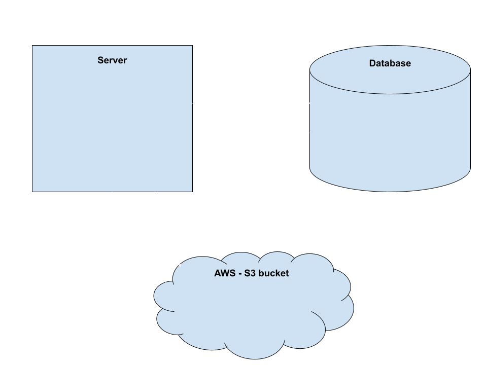

#PodcastStudio

### A tool to help podcaster to make money.


PodcastStudio is a full-stack web application that allows podcasters to insert an ad into their podcasts. 
First they upload the mp3 audio files, then they select which ad they would like to add to their podcast and so they can choose to publish the podcast, which makes their audios public so other users can play their edited podcast and follow their profile.

**Live Example** [PocastStudio](http://54.202.222.213/)

## Dependencies

* [Postgres](https://www.postgresql.org/download/)
* Python 3.7


## Installing

* ```$ git clone https://github.com/carolina-trofimov/Podcast-Studio.git```

* ```$ virtualenv env ``` -> to create virtual environment

* ```$ source env/bin/activate``` -> activate your virtual environment

* ```$ pip3 install awscli``` -> To install AWS CLI

* ```$ aws configure``` -> To add AWSAccessKeyId and AWSSecretKey

* ```$ createdb podcasts ``` -> to create your data base

* ```$ python3 models.py ``` 

* ```$ pip3 install -r requirements.txt ``` -> to install all the libraries needed

## Executing program

* ```$ source secrets.sh``` -> to source secret keys and

* ```$ python3 server.py ``` -> to start your server


## High level architecture


## Author:

 **Carolina Trofimov**

[LinkedIn](https://www.linkedin.com/in/carolina-trofimov/)

## Version History 

* 0.1
    * Initial release
